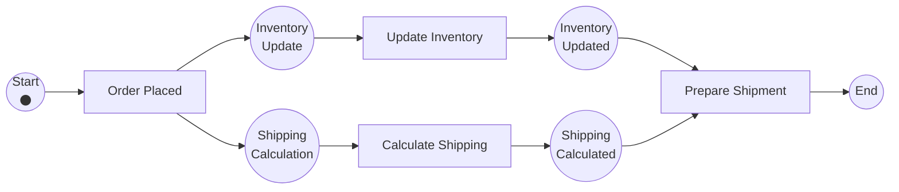

In our previous discussion on the ["polling trap,"]() we established that managing long-running state is an infrastructure concern, not a business logic one. But when we move beyond simple pauses and step into the realm of concurrent execution, the architectural friction multiplies exponentially. 

Consider a standard e-commerce order process. When a user checks out, the system must perform two discrete remote operations: (a) reserve the items via the Inventory service, and (b) calculate the delivery routes via the Logistics service. 

Doing these sequentially is an unacceptable waste of latency. Doing them in parallel within a standard Java application forces you into the weeds of `CompletableFuture.allOf()`, custom `ExecutorService` thread pools, and complex `try-catch` blocks to handle partial failures. 

Worse yet, how do you durably track this concurrent state in a database?

### The Hidden Finite State Machine

When developers try to orchestrate a distributed process using a standard database table, they rely on a `status` column. By doing this, they inadvertently build a Finite State Machine (FSM). 

The fundamental limitation of an FSM is that it can only ever exist in **one state at a time**. 

When you split an execution into two parallel branches, your single `status` column breaks down. You are forced to invent combinatorial statuses like `INVENTORY_DONE_SHIPPING_PENDING` or `SHIPPING_DONE_INVENTORY_PENDING`. As you add more parallel integrations, this state matrix explodes, resulting in brittle, unmaintainable spaghetti code. 

To solve this, we have to abandon the FSM and look at the mathematical model designed specifically for concurrent, distributed systems: the **Petri net**.

### Petri Nets: The Math of Concurrency

A Petri net is a directed bipartite graph. It models processes using three strict primitives:
* **Places (State):** Represented by circles. These are the conditions that must be met.
* **Transitions (Functions):** Represented by rectangles. These are the active tasks or events.
* **Tokens (Execution State):** Represented by dots inside the Places. 

A critical distinction must be made here: **The token is not the data payload.** The token represents the execution state—the program counter. 

A Petri net solves the concurrency problem through two native routing patterns:
1. **The AND-Split:** A single transition fires and produces *multiple* distinct tokens, routing one down each parallel branch. The single case is now executing in multiple states simultaneously.
2. **The AND-Join:** A downstream transition acts as a mathematical barrier. It will only "fire" (execute) when it receives a token from *every* incoming parallel branch. 

Because modern workflow engines are essentially specialized virtual machines built to execute Petri nets, they handle this token management for you natively.

### The WorkFlow Net (WF-Net) Boundaries

Not all Petri nets are workflows. To guarantee that a process will actually resolve, we use a restricted variant called a WorkFlow net (WF-net). 

A WF-net enforces strict boundaries: it must have exactly one source place (the start trigger) and exactly one sink place (the end state). Furthermore, every node must sit on a valid path between the start and the end. There can be no "dangling" tasks. 

When you define a process using a workflow engine, you are mapping your logic to these strict mathematical boundaries, guaranteeing that your concurrent branches will always systematically resolve.

To visualize this, we look to the foundational work of **Wil van der Aalst**. He demonstrated that by mapping processes to Petri nets, we gain a mathematically provable model for concurrent execution (van der Aalst, W.M.P. ["The Application of Petri Nets to Workflow Management"](https://www.researchgate.net/publication/220337578_The_Application_of_Petri_Nets_to_Workflow_Management), 1998).

Here is what that theoretical model looks like when mapped to our e-commerce order process:



In this architecture, the **graph structure** enforces concurrency semantics: a transition with multiple outgoing arcs creates parallel tokens; a transition with multiple incoming arcs blocks until all tokens arrive:

* **Places (Circles):** These represent the State or conditions.
* **Transitions (Rectangles):** These represent the Functions or active events (e.g., calling the Logistics API)
* **Tokens (The ⚫ Dot):** This represents the Execution State.

When the `Place Order` transition fires, it consumes the token from `Start` and produces two distinct tokens—one in `Update Inventory` and one in `Calculate Shipping`. The execution state is now running in parallel. The `Prepare Shipment` transition acts as our `AND-Join`; it is mathematically impossible for it to fire until it receives a token from both `Inventory Updated` and `Shipping Calculated`.


### Declarative Parallelism with Quarkus Flow

Let's look at how this mathematical theory translates into daily engineering using **[Quarkus Flow](https://github.com/quarkiverse/quarkus-flow)**. 

Because the engine natively implements the [CNCF Serverless Workflow specification](https://serverlessworkflow.io/), it implicitly understands WF-net boundaries and token synchronization. You do not need to write thread pools, and you do not need to invent combinatorial database statuses. 

Here is the concurrent order process, modeled using the fluent `FuncDSL`:

```java
import io.quarkiverse.flow.Flow;
import io.serverlessworkflow.api.types.Workflow;
import jakarta.enterprise.context.ApplicationScoped;
import jakarta.inject.Inject;

import static io.serverlessworkflow.fluent.func.FuncWorkflowBuilder.workflow;
import static io.serverlessworkflow.fluent.func.dsl.FuncDSL.*;

@ApplicationScoped
public class OrderProcessingWorkflow extends Flow {

    @Inject InventoryService inventory;
    @Inject ShippingService shipping;

    @Override
    public Workflow descriptor() {
        return workflow("order-processing")
            .tasks(
                // The AND-Split: Engine spawns concurrent execution tokens
                fork("parallel-processing",
                        function("updateInventory", (Order order) -> inventory.reserve(order), Order.class),
                        function("calculateShipping", (Order order) -> shipping.calculate(order), Order.class)),

                // The AND-Join: Engine blocks until all parallel tokens arrive
                // The control flow automatically merges before proceeding to the next task
                consume("finalizeOrder", (Order ctx) -> {
                    System.out.println("Inventory and shipping resolved. Finalizing order.");
                }, Order.class)
            )
            .build();
    }
}
```

Notice how the [`fork`](https://github.com/serverlessworkflow/specification/blob/main/dsl-reference.md#fork) block in the code directly maps to the `AND-split` in the Petri net diagram above. The engine handles token creation, persistence, and synchronization—developers simply declare the parallel structure.

The beauty of the specification is the implicit `AND-Join`. The engine knows that a parallel block must synchronize all underlying tokens before the execution state can drop down to the next task in the array (`prepareShipment`).

By trusting the math of the Petri net, we eliminate complex concurrency code and externalize our state management to a dedicated, mathematically sound control plane.

### Try It Yourself

The complete working example is available at [github.com/ricardozanini/quarkus-flow-fork-example](https://github.com/ricardozanini/quarkus-flow-fork-example).

To run the order processing workflow locally:

```bash
git clone https://github.com/ricardozanini/quarkus-flow-fork-example.git
cd quarkus-flow-fork-example
./mvnw quarkus:dev
``` 

Once running, submit an order and watch the parallel execution in the logs:

```bash
curl -X POST http://localhost:8181/orders \
-H "Content-Type: application/json" \
-d '{
    "orderId": "ORD-12345",
    "productId": "PROD-789",
    "quantity": 5,
    "totalAmount": 250.00
}'
```

You'll see both `Reserving inventory` and `Calculating shipping` messages appear concurrently, proving the `AND-split` token semantics in action.
