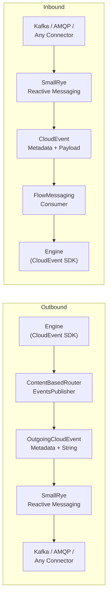

A workflow engine that can't talk to the outside world is just a fancy state machine running in isolation. The moment you need event-driven orchestration — pausing for a human approval, reacting to an external signal, emitting a domain event — you need a messaging bridge. And building one forces a decision: do you couple to Kafka? AMQP? Roll your own CloudEvent serialization and hope every connector plays nice?

In <a href='' target="_blank">previous posts</a>, we explored why declarative workflows beat hand-rolled state machines and how Petri net semantics power parallel execution. This post goes one layer deeper: **how Quarkus Flow actually moves events in and out of the engine**, and why the answer is simpler than you might expect.

The short version: Quarkus Flow doesn't implement its own messaging infrastructure. It delegates entirely to <a href="https://smallrye.io/smallrye-reactive-messaging/" target="_blank">SmallRye Reactive Messaging</a>. The messaging module is a thin translation layer between the workflow engine's CloudEvent objects and SmallRye's native CloudEvent metadata — nothing more.

### The Spec Says CloudEvents

The <a href="https://github.com/open-workflow-specification/specification" target="_blank">Open Workflow Specification</a> (a sandbox project in the CNCF) mandates that all inter-service communication happens via <a href="https://cloudevents.io/" target="_blank">CloudEvents</a>. This isn't a Quarkus Flow design choice — it's the spec. Every event flowing in or out of the engine must be a CloudEvent, carrying at minimum:

- **`type`** — what happened (e.g., `com.acme.order.approved`)
- **`source`** — who produced it (e.g., `api:/orders`)
- **`id`** — unique event identifier
- **`data`** — the actual payload (JSON, in practice)

The spec chose CloudEvents because they're **transport-agnostic**. A CloudEvent looks the same whether it rides on Kafka headers, AMQP application properties, or an HTTP webhook. That transport agnosticism is exactly what lets Quarkus Flow stay connector-neutral.

### The Bridge: Two Type Systems, One Translation Layer

Here's the architectural insight that makes everything click. There are **two distinct CloudEvent representations** in play:

1. **The CloudEvents SDK** (`io.cloudevents.CloudEvent`) — this is what the Open Workflow Specification's Java SDK uses internally. The engine produces and consumes these objects.
2. **SmallRye's CloudEvent metadata** (`io.smallrye.reactive.messaging.ce.CloudEventMetadata`) — this is how SmallRye Reactive Messaging represents CloudEvent attributes on messages. CE attributes travel as message metadata, not as the payload.

Quarkus Flow's messaging module exists to translate between these two representations. On the outbound side, it converts CloudEvent SDK objects into SmallRye metadata. On the inbound side, it reconstructs CloudEvent SDK objects from SmallRye metadata. That's it.



### Outbound: The Content-Based Router

The outbound side uses the <a href="https://www.enterpriseintegrationpatterns.com/patterns/messaging/ContentBasedRouter.html" target="_blank">Content-Based Router</a> pattern from Enterprise Integration Patterns. The engine doesn't know about channels or topics — it just calls `publish(CloudEvent)` on every registered `EventPublisher`. The routing logic splits the event stream into two channels based on the event type:

- **Domain events** (your workflow's business events) go to the `flow-out` channel via `FlowDomainEventsPublisher`
- **Lifecycle events** (engine-internal events like `io.serverlessworkflow.workflow.started.v1`) go to the `flow-lifecycle-out` channel via `FlowLifecycleEventsPublisher`

The discriminator is simple: if the event type starts with `io.serverlessworkflow`, it's a lifecycle event. Everything else is a domain event.

Both publishers extend `ContentBasedRouterEventsPublisher`, which does the actual translation:

```java
// Simplified — the real code handles all CE attributes
public CompletableFuture<Void> publish(CloudEvent event) {
    if (!accept(event))                       // routing decision
        return CompletableFuture.completedFuture(null);

    // 1. Extract data as a plain String
    String data = new String(event.getData().toBytes(), UTF_8);

    // 2. Build SmallRye CE metadata from the SDK CloudEvent
    var ceMetadata = OutgoingCloudEventMetadata.builder()
            .withId(event.getId())
            .withSource(event.getSource())
            .withType(event.getType())
            .build();

    // 3. Send: payload is the String data, CE attributes ride as metadata
    return outEmitter()
            .sendMessage(Message.of(data).addMetadata(ceMetadata))
            .subscribeAsCompletionStage();
}
```

The key thing to notice: **the payload is a plain `String`** and the CloudEvent attributes travel as SmallRye metadata. SmallRye then handles the transport-specific encoding — Kafka `ce_*` record headers, AMQP `cloudEvents:*` application properties, or structured JSON mode. You don't touch any of that.

### Inbound: Reconstructing the CloudEvent

The inbound side is the reverse translation. `FlowMessagingConsumer` listens on the `flow-in` channel and reconstructs full `io.cloudevents.CloudEvent` objects from SmallRye's metadata:

```java
@Incoming("flow-in")
@Acknowledgment(Strategy.MANUAL)
public CompletionStage<Void> onIncoming(Message<?> msg) {
    CloudEvent ce = resolveCloudEvent(msg); // SmallRye metadata → CE SDK object

    // Hand off to a worker thread to avoid blocking the Vert.x event loop
    return executor.runAsync(() -> dispatch(ce))
            .thenCompose(v -> msg.ack());
}
```

The `resolveCloudEvent` method extracts `CloudEventMetadata` from the incoming message, copies all attributes (id, source, type, extensions) into a `CloudEventBuilder`, and resolves the data payload — supporting `String`, `byte[]`, and `JsonObject` payloads out of the box.

Before events reach the publishers, a `MetadataPropagationEmittedEventDecorator` enriches every outgoing CloudEvent with **correlation metadata**: a `flowinstanceid` extension (the workflow instance's unique ID) and a `flowtaskid` extension (the JSON pointer of the emitting task). This is what lets external systems correlate callbacks to the correct waiting workflow instance.

### The Built-in Channels Are Just Defaults

Quarkus Flow registers three default channels when you set `quarkus.flow.messaging.defaults-enabled=true`:

| Channel | Direction | Purpose |
|---------|-----------|---------|
| `flow-in` | Inbound | Events that start or resume workflows |
| `flow-out` | Outbound | Domain events emitted by workflows |
| `flow-lifecycle-out` | Outbound | Engine lifecycle events (opt-in via `lifecycle-enabled=true`) |

These are **bare minimum defaults** — the simplest possible wiring to get event-driven workflows running. They're registered at build time as CDI beans via Quarkus's `AdditionalBeanBuildItem`, and they rely entirely on SmallRye channels that you configure in `application.properties`.

**You can and should implement your own publishers and consumers when you need more control.**

The engine's contract is straightforward:

- **Inbound**: the engine expects `io.cloudevents.CloudEvent` objects. If your external systems don't produce CloudEvents natively, no problem — write a SmallRye consumer that ingests whatever format you receive (Avro, Protobuf, plain JSON) and transforms it into a CloudEvent before pushing it to the engine. The default `FlowMessagingConsumer` is just one possible implementation.

- **Outbound**: the engine emits `io.cloudevents.CloudEvent` objects through the `EventPublisher` SPI. The default publishers translate them to SmallRye messages and send them to `flow-out` / `flow-lifecycle-out`. But you could implement an `EventPublisher` that enriches events, filters them, routes to different channels based on custom criteria, or transforms the CloudEvent into a completely different format before publishing.

The default channels are training wheels. For production systems with complex event topologies, replace them.

### The CloudEvents API: SmallRye, Not the CE SDK

This is the gotcha that trips up most users on their first integration.

When you write a downstream consumer that reads from `flow-out`, you might instinctively write this:

```java
@Incoming("my-flow-out-consumer")
public void consume(CloudEvent event) {  // DON'T do this
    String type = event.getType();
    byte[] data = event.getData().toBytes();
}
```

This will throw a `ClassCastException`. SmallRye Reactive Messaging **does not auto-deserialize** the message payload into a CloudEvents SDK `CloudEvent` object. The CE attributes travel in transport headers (Kafka `ce_*`, AMQP `cloudEvents:*`) and SmallRye exposes them via `CloudEventMetadata` on the message metadata — not in the payload.

The correct pattern:

```java
@Incoming("my-flow-out-consumer")
public CompletionStage<Void> consume(Message<String> msg) {
    // CE attributes come from SmallRye metadata
    CloudEventMetadata<?> ce = msg.getMetadata(CloudEventMetadata.class)
            .orElseThrow();

    String type = ce.getType();
    String instanceId = ce.<String>getExtension("flowinstanceid").orElse(null);

    // The payload IS the data — not a CE envelope
    String data = msg.getPayload();

    return msg.ack();
}
```

The import is `io.smallrye.reactive.messaging.ce.CloudEventMetadata`, not `io.cloudevents.CloudEvent`. This applies to **any SmallRye connector** — Kafka, AMQP, or in-memory. The CE SDK types (`io.cloudevents.*`) are the engine's internal language; SmallRye's CE metadata is what you interact with on the messaging boundary.

### Any SmallRye Connector Works

We test Quarkus Flow with Kafka and AMQP. But the messaging bridge doesn't know or care which connector you're using — it sits on top of SmallRye's connector-agnostic API. Any connector that SmallRye supports should work: Pulsar, RabbitMQ, or even the in-memory connector for testing.

The configuration is standard MicroProfile Reactive Messaging. Kafka:

```properties
mp.messaging.incoming.flow-in.connector=smallrye-kafka
mp.messaging.incoming.flow-in.topic=flow-in

mp.messaging.outgoing.flow-out.connector=smallrye-kafka
mp.messaging.outgoing.flow-out.topic=flow-out
```

AMQP — swap the connector and replace `topic` with `address`:

```properties
mp.messaging.incoming.flow-in.connector=smallrye-amqp
mp.messaging.incoming.flow-in.address=flow-in

mp.messaging.outgoing.flow-out.connector=smallrye-amqp
mp.messaging.outgoing.flow-out.address=flow-out
```

In-memory for unit tests:

```properties
mp.messaging.incoming.flow-in.connector=smallrye-in-memory
mp.messaging.outgoing.flow-out.connector=smallrye-in-memory
```

No custom serializers, no special CloudEvent dependencies, no transport-specific code. SmallRye handles the wire format.

The messaging bridge is intentionally thin. It doesn't re-implement CloudEvent serialization, doesn't mandate a transport, and doesn't force a specific channel topology. It translates between two CE type systems and lets SmallRye handle the rest. If the defaults don't fit your architecture, replace them — the engine only cares that it receives CloudEvents on the inbound side and can publish them on the outbound side. Everything in between is yours to shape.
