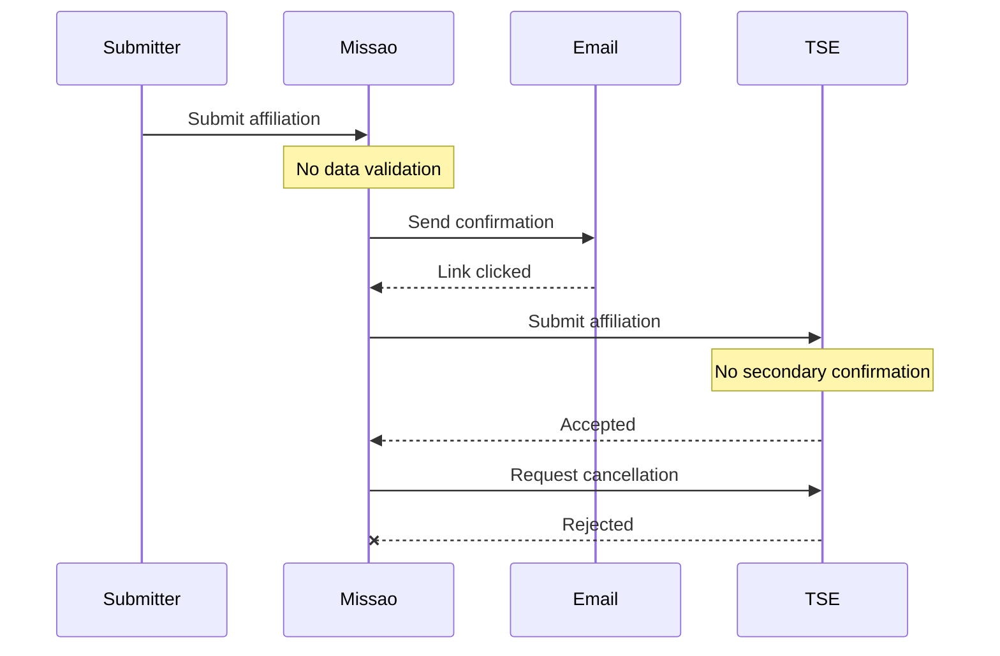
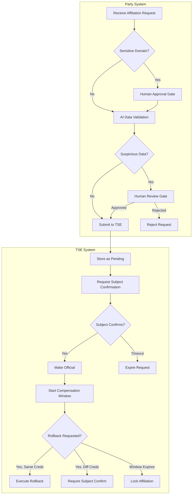

On August 12, 2026, at 11:17 PM — two days before Brazil's candidate registration deadline — Senator Flávio Bolsonaro's party affiliation was changed in the TSE (Tribunal Superior Eleitoral) database from PL to Partido Missão. The change blocked his presidential candidacy registration. The TSE confirmed there was no system breach: the affiliation was submitted through Missão's party system, which internally uses the party Secretary's credentials to communicate with TSE. What followed was a political firestorm, a police investigation, and mutual accusations between the parties involved.

This post is not about who clicked what, who lied, or who is to blame. Those questions are for investigators. This post is about the **architectural patterns that were missing** — validation gates that, regardless of intent (malicious actor, compromised credentials, or human error), would have prevented a registration with obviously fabricated data from ever reaching the electoral database.

The reported registration included an address of "Rua dos Bandidos, 666" — a pun that translates roughly to "Criminals Street, 666." Whether this was a joke, a test, or deliberate sabotage, no system handling identity-sensitive government registrations should have accepted it. The failure was not in access control — the credentials were valid. The failure was in **workflow validation**.

Sources: [CNN Brasil](https://www.cnnbrasil.com.br/eleicoes/missao-diz-que-foi-vitima-de-filiacao-fraudulenta-de-flavio-bolsonaro/), [Deutsche Welle](https://noticias.uol.com.br/ultimas-noticias/deutschewelle/2026/08/14/a-fraude-que-fez-flavio-bolsonaro-virar-filiado-do-missao.htm), [G1](https://g1.globo.com/politica/noticia/2026/08/13/filiacao-de-flavio-bolsonaro-ao-missao-veja-o-que-ja-se-sabe.ghtml)

### The Technical Gaps

Based on public reporting, the affiliation flow worked roughly as follows:

1. Someone used Missão's public affiliation system to submit the registration
2. The system registered a new affiliation using the senator's email address and fabricated personal data
3. A confirmation email was allegedly sent to the senator's email address
4. The email was allegedly opened (whether by the senator, staff, or an attacker is unknown)
5. The system submitted the affiliation to the TSE, which accepted it immediately
6. When Missão attempted same-day cancellation, TSE rejected the request



Note: The `Submitter` represents whoever used Missão's public affiliation system. The system internally uses the party Secretary's credentials to submit to TSE — so any submission through the public interface appears to TSE as an authorized party request.

Four validation patterns were missing:

1. **Domain-based human approval**: Government email domains (like `senado.leg.br`) should trigger manual review before any external system action
2. **AI-powered data validation**: Fabricated addresses like "Rua dos Bandidos, 666" should be flagged for human review
3. **Multi-party confirmation**: TSE should require confirmation from the person being affiliated, not just the submitting party
4. **Time-bounded compensation**: Same-credential rollback should be permitted within a reasonable window

All four patterns are implementable with [Quarkus Flow](https://github.com/quarkiverse/quarkus-flow). Let's build them.

> **Note:** The workflows below are illustrations of what can be done with Quarkus Flow, not production-ready code. A real implementation would require additional error handling, security hardening, integration with actual government APIs, and thorough testing.

### Pattern 1: Domain-Based Human Approval Gates

When processing sensitive registrations, certain email domains should automatically escalate to human review. Government domains, corporate domains, or domains on a watchlist should never proceed through automated flows without explicit approval.

```java
@ApplicationScoped
public class AffiliationWorkflow extends Flow {

    private static final Set<String> SENSITIVE_DOMAINS = Set.of(
        "senado.leg.br", "camara.leg.br", "gov.br", "stf.jus.br", "tse.jus.br"
    );

    @ConfigProperty(name = "email.service.url")
    String emailServiceUrl;

    @ConfigProperty(name = "tse.endpoint.url")
    String tseEndpointUrl;

    @Override
    public Workflow descriptor() {
        return FlowWorkflowBuilder.workflow("party-affiliation", "acme", "1.0")
            .tasks(
                // Extract domain and check if sensitive
                function("checkDomain", (AffiliationRequest req) -> {
                    String domain = req.email().split("@")[1];
                    return new DomainCheck(domain, SENSITIVE_DOMAINS.contains(domain));
                }, AffiliationRequest.class),

                // Route based on domain sensitivity
                switchWhenOrElse(
                    (DomainCheck check) -> check.isSensitive(),
                    "requireHumanApproval",
                    "sendConfirmationEmail"),

                // Sensitive domain: wait for party official approval (48h window)
                listen("requireHumanApproval", toOne("affiliation.approved.v1"))
                    .timeout(timeoutHours(48))
                    .then(FlowDirectiveEnum.CONTINUE),

                // Standard flow: send confirmation email
                http("sendConfirmationEmail")
                    .method("POST")
                    .endpoint(emailServiceUrl + "/send-confirmation")
                    .body("${ . }"),

                // Wait for email confirmation (72h window)
                listen("awaitEmailConfirmation", toOne("affiliation.confirmed.v1"))
                    .timeout(timeoutHours(72)),

                // Submit to TSE
                http("submitToTSE")
                    .method("POST")
                    .endpoint(tseEndpointUrl + "/affiliations")
                    .body("${ . }"))
            .build();
    }

    record DomainCheck(String domain, boolean isSensitive) {}
}
```

The key insight: the `listen` task with `toOne()` suspends the workflow until an external event arrives. For sensitive domains, a party official must explicitly approve before the flow continues. This is a **human-in-the-loop gate** — the workflow cannot proceed without deliberate human action.

Note the `.then(FlowDirectiveEnum.CONTINUE)` directive — this tells the engine to proceed to the next task in sequence after the event arrives. In contrast, `.then(FlowDirectiveEnum.END)` terminates the workflow at that point. We use `CONTINUE` here because approval is a gate, not a terminal state; the workflow must proceed to send confirmation emails and submit to TSE.

In YAML, the same pattern:

```yaml
document:
  dsl: '1.0.0'
  namespace: acme
  name: party-affiliation
  version: '1.0.0'
do:
  - extractDomain:
      set:
        domain: ${ .email | split("@")[1] }

  - checkDomain:
      switch:
        - sensitiveDomain:
            when: ${ .domain | inside(["senado.leg.br", "camara.leg.br", "gov.br"]) }
            then: requireHumanApproval
        - default:
            then: sendConfirmationEmail

  - requireHumanApproval:
      listen:
        to:
          one:
            with:
              type: affiliation.approved.v1
      timeout:
        after:
          hours: 48

  - sendConfirmationEmail:
      call: http
      with:
        method: post
        endpoint: https://email.acme.org/send-confirmation

  - awaitEmailConfirmation:
      listen:
        to:
          one:
            with:
              type: affiliation.confirmed.v1
      timeout:
        after:
          hours: 72

  - submitToTSE:
      call: http
      with:
        method: post
        endpoint: https://api.tse.jus.br/affiliations
```

Had this pattern been in place, any affiliation attempt using a `senado.leg.br` email would have required explicit approval from a Missão party official — someone who would presumably recognize that affiliating a sitting senator from an opposing party deserves scrutiny.

### Pattern 2: AI-Powered Data Validation

Some fabricated data is subtle. But "Rua dos Bandidos, 666"? That's a joke. A simple LLM-based validation agent can flag obviously suspicious data for human review.

```java
@RegisterAiService
@ApplicationScoped
@SystemMessage("""
    You are a data validation agent for a Brazilian party registration system.
    Analyze the provided registration data and flag anything suspicious:
    - Addresses that appear fake, offensive, or satirical
    - Names that appear to be jokes or test data
    - Phone numbers that are clearly invalid
    - Any data that seems designed to mock or test the system
    
    Respond with JSON: {"suspicious": true/false, "reason": "explanation"}
    Default to suspicious=true if uncertain.
    """)
public interface DataValidationAgent {
    @UserMessage("Validate this registration: {data}")
    ValidationResult validate(@V("data") String data);
}
```

The workflow integrates this agent as a validation gate:

```java
@ApplicationScoped
public class ValidatedAffiliationWorkflow extends Flow {

    @Inject
    DataValidationAgent validationAgent;

    @ConfigProperty(name = "registration.service.url")
    String registrationServiceUrl;

    @Override
    public Workflow descriptor() {
        return FlowWorkflowBuilder.workflow("validated-affiliation", "acme", "1.0")
            .tasks(
                // AI validation of registration data
                function("validateData", 
                    (RegistrationData data) -> validationAgent.validate(data.toJson()),
                    RegistrationData.class),

                // Route based on AI assessment
                switchWhenOrElse(
                    (ValidationResult result) -> result.suspicious(),
                    "flagForReview",
                    "proceedWithRegistration"),

                // Suspicious data: emit event and wait for human review
                emitJson("flagForReview", "registration.flagged.v1", ValidationResult.class),
                listen("awaitHumanReview", toOne("registration.reviewed.v1")),

                // Check review decision
                switchWhenOrElse(
                    (ReviewDecision decision) -> decision.approved(),
                    "proceedWithRegistration",
                    "rejectRegistration"),

                // Standard registration flow continues...
                http("proceedWithRegistration")
                    .method("POST")
                    .endpoint(registrationServiceUrl + "/submit")
                    .body("${ . }")
                    .then(FlowDirectiveEnum.END),

                // Rejection path
                set("rejectRegistration", "{ status: \"rejected\", reason: .reason }"))
            .build();
    }

    record ValidationResult(boolean suspicious, String reason) {}
    record ReviewDecision(boolean approved) {}
}
```

The LangChain4j integration requires minimal dependencies:

```xml
<dependency>
    <groupId>io.quarkiverse.flow</groupId>
    <artifactId>quarkus-flow-langchain4j</artifactId>
</dependency>
<dependency>
    <groupId>io.quarkiverse.langchain4j</groupId>
    <artifactId>quarkus-langchain4j-ollama</artifactId>
</dependency>
```

An LLM analyzing "Rua dos Bandidos, 666" would immediately flag it as suspicious. The workflow would suspend, emit a `registration.flagged.v1` event, and wait for human review. No automated submission to TSE would occur.

Note the AI serves only as a **flagging mechanism**, never as a unilateral rejection gate. Because LLMs can hallucinate or misinterpret edge cases (a legitimate street name might sound suspicious to a model unfamiliar with local geography), the final decision always routes to a human reviewer. The AI accelerates detection; humans own the decision.

### Pattern 3: Multi-Party Confirmation Saga

The most critical missing pattern was on the TSE side. The electoral authority accepted an affiliation without confirming with the person being affiliated. This is a **single-party trust model** — the submitting system is trusted implicitly.

A robust design requires **multi-party confirmation**: both the submitting party and the subject must confirm before the registration becomes official.

Critically, this workflow must run on the **receiving authority's infrastructure** (TSE), not the submitting party's. Multi-party confirmation only works when the central authority orchestrates the trust — if the submitting party controlled the confirmation flow, they could simply skip it.

```yaml
document:
  dsl: '1.0.0'
  namespace: tse
  name: affiliation-confirmation
  version: '1.0.0'
do:
  # Receive affiliation request from party system
  - receiveRequest:
      listen:
        to:
          one:
            with:
              type: affiliation.submitted.v1

  # Store as pending (not yet official)
  - storePending:
      call: http
      with:
        method: post
        endpoint: https://db.tse.jus.br/affiliations/pending

  # Send confirmation request to the SUBJECT (not the party)
  - requestSubjectConfirmation:
      call: http
      with:
        method: post
        endpoint: https://notifications.tse.jus.br/send
        body:
          recipient: ${ .subjectEmail }
          template: affiliation-confirmation
          correlationId: ${ .affiliationId }

  # Wait for subject confirmation (adjust duration to match regulatory deadlines)
  # If no confirmation within 30 days, workflow times out (request expires)
  - awaitSubjectConfirmation:
      listen:
        to:
          one:
            with:
              type: affiliation.subject-confirmed.v1
              # CloudEvent 'subject' attribute matches the workflow instance
              subject: ${ .affiliationId }
      timeout:
        after:
          days: 30  # In fast-paced registration contexts, reduce to hours or days

  # Subject confirmed: make official
  - makeOfficial:
      call: http
      with:
        method: post
        endpoint: https://db.tse.jus.br/affiliations/confirm
      then: end

  - notifyParties:
      emit:
        event:
          with:
            type: affiliation.completed.v1
```

The critical change: TSE sends a confirmation request to the **subject's verified identity** (not just an email the party provided, but through official government channels — CPF-linked notification, gov.br app, registered address). The affiliation only becomes official when the subject explicitly confirms.

Had this pattern been in place, Flávio Bolsonaro would have received an official TSE notification asking: "Do you confirm your affiliation to Partido Missão?" The answer would have been no. The affiliation would never have been recorded.

### Pattern 4: Time-Bounded Compensation Windows

Even with validation gates, mistakes happen. Systems need **compensation windows** — time periods during which the submitting party can reverse an action without bureaucratic overhead.

```java
@ApplicationScoped
public class CompensatableAffiliationWorkflow extends Flow {

    @ConfigProperty(name = "tse.database.url")
    String tseDatabaseUrl;

    @Override
    public Workflow descriptor() {
        return FlowWorkflowBuilder.workflow("compensatable-affiliation", "tse", "1.0")
            .tasks(
                // Record affiliation with compensation window metadata
                http("recordAffiliation")
                    .method("POST")
                    .endpoint(tseDatabaseUrl + "/affiliations")
                    .body("${ . + {compensationWindowDays: 30} }"),

                // Listen for rollback request with compensation window timeout
                // If no rollback within 30 days, workflow times out (affiliation is locked)
                listen("awaitRollback", toOne("affiliation.rollback.v1"))
                    .timeout(timeoutDays(30)),

                // Validate: same credentials that submitted?
                switchWhenOrElse(
                    (RollbackRequest req) -> req.credentials().equals(req.originalCredentials()),
                    "executeRollback",
                    "requireSubjectConfirmation"),

                // Same credentials: immediate rollback
                http("executeRollback")
                    .method("DELETE")
                    .endpoint(tseDatabaseUrl + "/affiliations/${.affiliationId}")
                    .then(FlowDirectiveEnum.END),

                // Different credentials: require subject confirmation
                listen("requireSubjectConfirmation", 
                    toOne("affiliation.subject-rollback-confirmed.v1")),

                http("executeConfirmedRollback")
                    .method("DELETE")
                    .endpoint(tseDatabaseUrl + "/affiliations/${.affiliationId}"))
            .build();
    }

    record RollbackRequest(String credentials, String originalCredentials, String affiliationId) {}
}
```

The `timeout(timeoutDays(30))` on the `listen` task enforces the compensation window. If no rollback request arrives within 30 days, the workflow times out — effectively locking the affiliation. The timeout is declarative: the workflow engine handles scheduling and expiration automatically.

The compensation logic:

| Scenario | Within 30 Days | After 30 Days |
|----------|----------------|---------------|
| Same credentials request rollback | Immediate approval | Requires subject confirmation |
| Different credentials request rollback | Requires subject confirmation | Requires subject confirmation |
| Subject requests rollback | Immediate approval | Immediate approval |

Had this pattern been in place, Missão's same-day cancellation request — made with the same credentials that submitted the affiliation — would have been accepted automatically. The incident would have been a minor internal security review, not a national political crisis.

### Putting It Together

A robust party affiliation system combines all four patterns:



Each gate is a `listen` task. Each validation is a `switch` or AI function. Each timeout is a `wait` with compensation. The workflow engine handles state persistence, event correlation, and timeout management — the complexity that ad-hoc implementations invariably get wrong.

### Systems That Handle Trust Require Workflows That Enforce It

The TSE affiliation incident was not a hack. The credentials were valid. The system worked exactly as designed. That is the problem.

When systems handle identity-sensitive registrations — party affiliations, corporate directorships, property titles, medical authorizations — they cannot rely solely on access control. Valid credentials are necessary but not sufficient. The workflow itself must enforce validation: domain-based escalation, AI-powered anomaly detection, multi-party confirmation, and time-bounded compensation.

These are not exotic patterns. They are the kind of orchestration logic that workflow engines like [Quarkus Flow](https://github.com/quarkiverse/quarkus-flow) make straightforward to implement. A `listen` task waiting for human approval. A `function` task calling an LLM validator. A `fork` task managing compensation windows. The building blocks exist.

What was missing in August 2026 was not technology. It was architecture.

**Resources:**
- [Quarkus Flow GitHub](https://github.com/quarkiverse/quarkus-flow)
- [Human-in-the-Loop Patterns](https://docs.quarkiverse.io/quarkus-flow/dev/messaging.html)
- [LangChain4j Integration](https://docs.quarkiverse.io/quarkus-flow/dev/langchain4j.html)
- [Open Workflow Specification](https://github.com/open-workflow-specification/specification)
